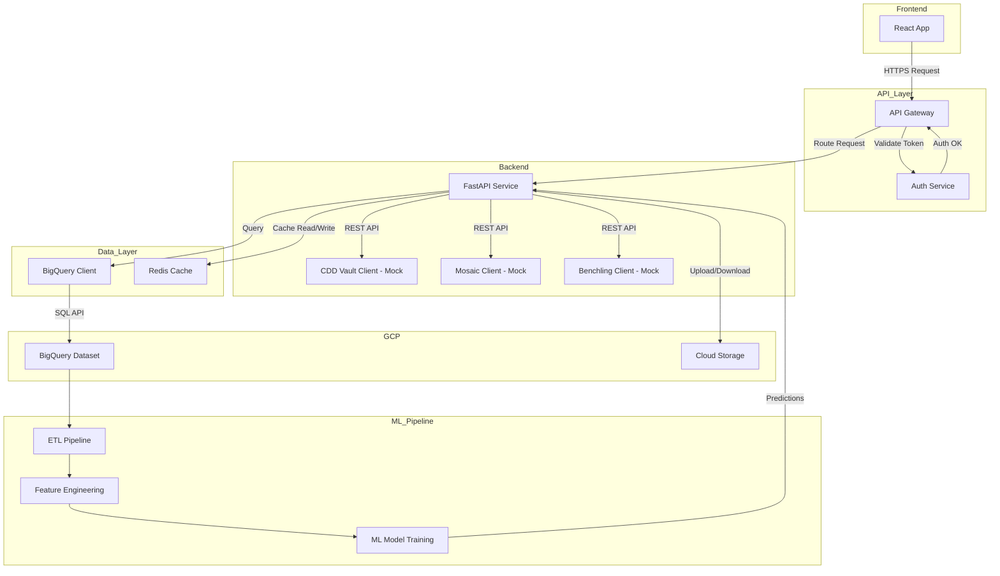

# drug-discovery-data-engineering-prototype

## Description
A full-stack prototype for a Drug Discovery Data Engineering platform, closely aligned with the Calico Senior Data Engineer JD. This project demonstrates:
- End-to-end data flow from laboratory informatics systems (mocked CDD Vault, Mosaic, Benchling) to a cloud data warehouse (GCP BigQuery)
- A Python FastAPI backend for data integration and API exposure
- A React frontend for data visualization and review
- Infrastructure-as-code with Terraform for GCP resource provisioning
- Containerization with Docker and CI/CD readiness

## Architecture


## Setup Instructions
### Prerequisites
- Docker
- Google Cloud account with BigQuery enabled
- (Optional) Node.js and Python 3.10+ for local development

### 1. Infrastructure (Terraform)
```
cd infra
terraform init
terraform apply -var="project_id=YOUR_GCP_PROJECT_ID"
```

### 2. Backend (FastAPI)
```
cd backend
docker build -t drug-backend .
# Mount GCP credentials and set env var:
docker run -p 8000:8000 \
  -v $HOME/.config/gcloud/application_default_credentials.json:/app/application_default_credentials.json \
  -e GOOGLE_APPLICATION_CREDENTIALS=/app/application_default_credentials.json \
  drug-backend
```

### 3. Frontend (React)
```
cd frontend
docker build -t drug-frontend .
docker run -p 3000:3000 drug-frontend
```

### 4. Access the App
- Open http://localhost:3000
- The frontend displays data from CDD Vault, Mosaic, Benchling (mocked), and real BigQuery tables

## Usage
- The backend exposes endpoints for each data source and `/bigquery/data` for live BigQuery data
- The frontend fetches and displays all data sources
- Easily extend to real APIs by replacing mock clients

## Alignment with Calico JD
- **End-to-End Project Ownership:** Demonstrates requirements gathering, integration, and deployment
- **System Integration:** Connects multiple informatics systems and GCP BigQuery
- **Data Flow Architecture:** Shows seamless data movement and review
- **Full-Stack Tool Development:** Combines Python (FastAPI) and React
- **Engineering Excellence:** Uses Docker, Terraform, and best practices for CI/CD
- **Mentorship & Leadership:** Code is modular, documented, and ready for team onboarding

## Data Governance & Security
- All data access is authenticated using GCP Application Default Credentials or service accounts.
- Sensitive credentials are never stored in code or version control; use environment variables or secret managers.
- Data access is logged and can be audited via GCP logs.
- For production, enforce least-privilege IAM roles and enable VPC Service Controls.
- Ensure compliance with internal and external data privacy standards (e.g., HIPAA, GDPR) as required.

## Testing & CI/CD
- Add tests in `backend/tests/` and `frontend/src/__tests__/` (see sample test files).
- Example backend test (pytest):
  ```python
  # backend/tests/test_main.py
  from fastapi.testclient import TestClient
  from main import app
  client = TestClient(app)
  def test_root():
      resp = client.get("/")
      assert resp.status_code == 200
  ```
- Example frontend test (Jest):
  ```js
  // frontend/src/__tests__/App.test.js
  import { render, screen } from '@testing-library/react';
  import App from '../App';
  test('renders prototype title', () => {
    render(<App />);
    expect(screen.getByText(/Drug Discovery Data Engineering Prototype/i)).toBeInTheDocument();
  });
  ```
- CI/CD: Add a workflow in `.github/workflows/ci.yml` to run tests and lint on push.

## Extending Mocks to Real APIs
- Replace logic in `backend/routers/cdd.py`, `mosaic.py`, and `benchling.py` with real API calls using official SDKs or REST endpoints.
- Store API credentials securely (e.g., GCP Secret Manager, environment variables).
- Update the frontend to handle real data schemas and error cases.
- See each router file for comments on where to insert real integration code.

---

> For questions or demo, contact the project author.
